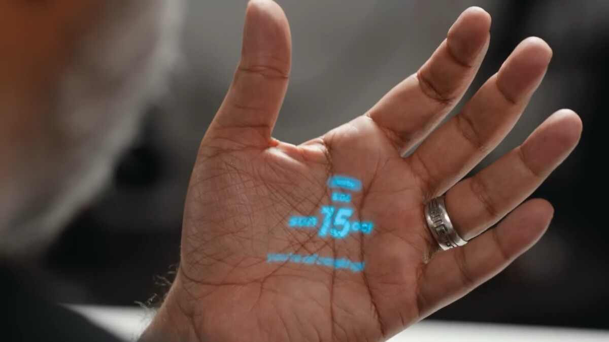

AI Pin, le produit tant attendu d'Humane, prend enfin forme après des mois de rumeurs. La startup a récemment levé le voile sur ce dispositif novateur dénué d'écran, destiné à supplanter les smartphones dans un avenir proche.

## Table of contents

## Vision futuriste de Humane pour les smartphones

La vision futuriste de Humane transforme le concept du smartphone, le reléguant non plus à la paume de la main, mais à l'épaule, accroché à votre veste. AI Pin, cet étrange appareil carré, a été dévoilé et finalement mise sur le marché.

Alors que The Verge avait déjà esquissé quelques détails, la société a fourni davantage d'informations et présenté les premiers prototypes dans une [vidéo](https://twitter.com/Humane/status/1722668651705430154?ref_src=twsrc%5Etfw%7Ctwcamp%5Etweetembed%7Ctwterm%5E1722668651705430154%7Ctwgr%5Eef8be1b06a9a609f8c1b8c40e2462c66dfec5d5e%7Ctwcon%5Es1_&ref_url=https%3A%2F%2Fwww.bfmtv.com%2Ftech%2Fsmartphone%2Fhumane-ai-pin-tout-ce-que-l-on-sait-du-futur-du-smartphone-sans-ecran-avec-chat-gpt_AN-202311100425.html).

Il y a quelques mois, AI Pin avait fait sa première apparition en promettant de supplanter les écrans. Fondée par d'anciens employés d'Apple, la startup Humane avait présenté un petit boîtier carré portable, qui tient dans la paume de la main et fonctionne principalement à l'aide de l'intelligence artificielle.

## Technologie "Invisible"

Selon les informations divulguées, AI Pin s'attache magnétiquement à un vêtement ou à une surface et peut être rechargé facilement grâce à "deux boosters de batterie". Malheureusement, aucune information sur l'autonomie n'a été révélée. La configuration initiale doit être effectuée via une interface web ou une autre plateforme, qui recueille par la suite toutes les informations contenues dans l'appareil, telles que les notes, les photos et les vidéos.

Doté d'une caméra, d'un projecteur et d'un haut-parleur, AI Pin peut afficher les messages reçus et prendre des appels en projetant les informations sur une surface. L'utilisateur peut également connecter des écouteurs en Bluetooth. Humane a équipé son produit d'un processeur Qualcomm, dont le modèle reste confidentiel.

Selon The Verge, le dispositif tire parti des modèles d'IA de Microsoft et d'OpenAI. Le système d'exploitation d'Humane, baptisé Cosmos, ne se limite pas à un simple ensemble d'applications commandées, mais constitue plutôt une collection de plugins de ChatGPT à configurer pour personnaliser les fonctionnalités du chatbot alimenté par GPT-4.

Ce virage vers une technologie "invisible" pourrait représenter une révolution majeure. Cette innovation suscite la réflexion : et si la prédominance du smartphone n'était qu'une étape vers un avenir où la technologie, bien qu'omniprésente, se ferait discrète, voire invisible ? Cette idée rappelle les propos de Heidegger sur la technologie, suggérant qu'elle devrait nous libérer plutôt que nous dominer.

AI Pin conserve tous les avantages d'un smartphone tout en se débarrassant de l'écran. Il fonctionne de manière entièrement autonome et est proposé à partir de 699 dollars, avec un abonnement mensuel de 24 dollars à un réseau sans fil d'Humane, en partenariat avec l'opérateur T-Mobile. Cette offre comprend le stockage cloud, l'utilisation des modèles IA et un nouveau numéro de téléphone pour l'utilisateur.

Les [précommandes](https://hu.ma.ne/) débuteront le jeudi 16 novembre, mais seront initialement limitées aux États-Unis.

### Sources

- [Randroid](https://www.frandroid.com/editoid/1852461_humane-ai-pin-est-ce-la-fin-du-smartphone)
- [BFMTech](https://www.bfmtv.com/tech/smartphone/humane-ai-pin-tout-ce-que-l-on-sait-du-futur-du-smartphone-sans-ecran-avec-chat-gpt_AN-202311100425.html)
- [Humane](https://hu.ma.ne/aipin)
