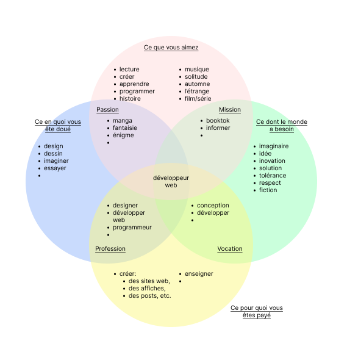

## Carina Da Fonseca Pinto

Je suis étudiante à l'HEIG-VD en Ingénerie des médias. D'après mon Ikigai, mon domaine de prédilection est le développement web.

## Domaine: Développement web

Le domaine du développement web est vaste et en constante évolution, englobant un ensemble de compétences et de technologies liées à la création, à la conception et à la maintenance de sites web et d'applications web. Voici quelques aspects clés du développement web :

- **Développement Front-end :** Le développement front-end se concentre sur la création de l'interface utilisateur visible par les utilisateurs. Les langages couramment utilisés incluent HTML, CSS et JavaScript. Les frameworks tels que React, Angular et Vue.js sont populaires pour simplifier le développement front-end.

- **Développement Back-end :** Le développement back-end concerne la logique et la gestion des données derrière l'interface utilisateur. Des langages comme Node.js, Python (Django, Flask), Ruby (Ruby on Rails), Java (Spring), et PHP sont utilisés pour construire des serveurs et des applications back-end.

- **Full Stack Development :** Les développeurs full stack sont capables de travailler à la fois sur le front-end et le back-end. Ils ont une compréhension globale du processus de développement web.

- **Base de données :** Les développeurs web travaillent souvent avec des bases de données pour stocker et récupérer des informations. Des technologies comme MySQL, PostgreSQL, MongoDB, et SQLite sont couramment utilisées.

- **Développement Mobile :** Les technologies comme React Native, Flutter, et Xamarin permettent aux développeurs de créer des applications mobiles en utilisant des compétences web existantes.

- **Sécurité Web :** Les développeurs web doivent être conscients des problèmes de sécurité tels que la protection contre les attaques par injection SQL, les attaques CSRF, et la sécurisation des communications via HTTPS.

Le développement web offre une variété de rôles et d'opportunités, allant des développeurs juniors et seniors aux spécialisations telles que l'ingénierie front-end, le développement back-end, la sécurité web, et la gestion de projet. La collaboration entre développeurs, concepteurs, et autres professionnels est souvent essentielle pour mener à bien des projets web réussis.
